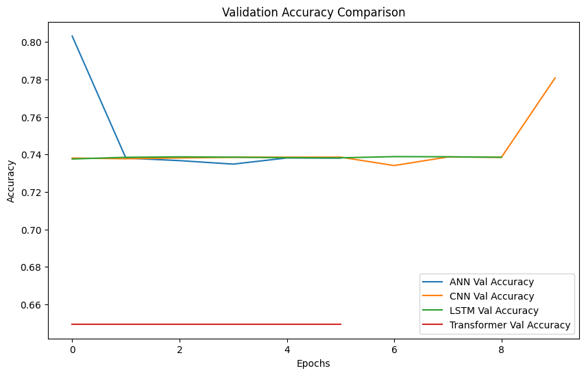
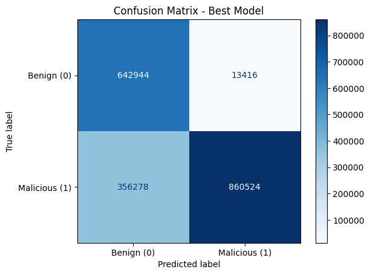

# Archived Final Project Results

These metrics and figures come from the saved outputs of the original university final-project notebooks. They preserve what the project produced at the time and were not regenerated during the repository cleanup.

## Original merged-dataset run

The original notebook combined eleven IoT-23 capture files into a 24,975,484-row CSV, sampled 50% of the rows, and then used a random 70/15/15 row split. The resulting test set contained 1,873,162 connections.

| Model | Test accuracy | Test loss |
|---|---:|---:|
| Artificial neural network | 80.26% | 0.3672 |
| One-dimensional CNN | 78.10% | 0.3973 |
| LSTM | 73.85% | 0.4071 |
| Transformer | 64.96% | 0.6478 |

The artificial neural network produced the strongest saved accuracy. Its classification report recorded 98% recall for benign traffic and 71% recall for malicious traffic. That difference matters more operationally than the overall accuracy because missed malicious connections are false negatives.

## Why these numbers are archival

The original workflow fitted categorical encoders and the standard scaler before splitting the data. It also placed randomly selected rows from the same captures into training and testing. Both choices can make test performance look better than performance on an unseen capture.

The old CNN, LSTM, and Transformer treated the ten tabular feature columns as a sequence. The feature order is not time order, so the inductive assumptions of those architectures are difficult to justify. The cleaned notebook uses a dense neural network for the portfolio comparison and includes logistic regression as a transparent baseline.

The original notebook contains a recoverable CSV parser error, hard-coded Google Drive paths, and raw runtime output. It remains under [`archive/notebooks/original-merged-dataset-run.ipynb`](archive/notebooks/original-merged-dataset-run.ipynb) as historical evidence rather than the recommended entry point.

## Single-capture result

The report recorded approximately 99.8% accuracy for an LSTM trained on a smaller single-capture dataset. A separate coursework notebook produced 99.97% after including `det_label`, a field derived from the ground-truth annotation. Because this directly leaks the target and a single capture is easier to memorize, neither near-perfect number should be presented as evidence of generalization.

## Reproducibility status

The cleaned notebook has no claimed benchmark result until it is run on a documented IoT-23 copy. A future result should record the capture IDs assigned to each split, package versions, sampling limits, random seed, all class-sensitive metrics, and the selected classification threshold.
